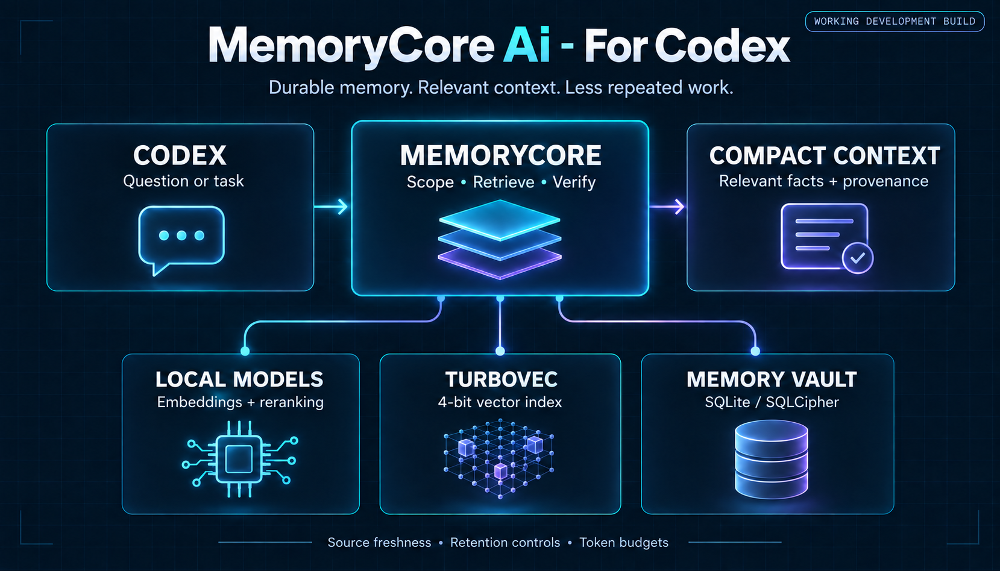
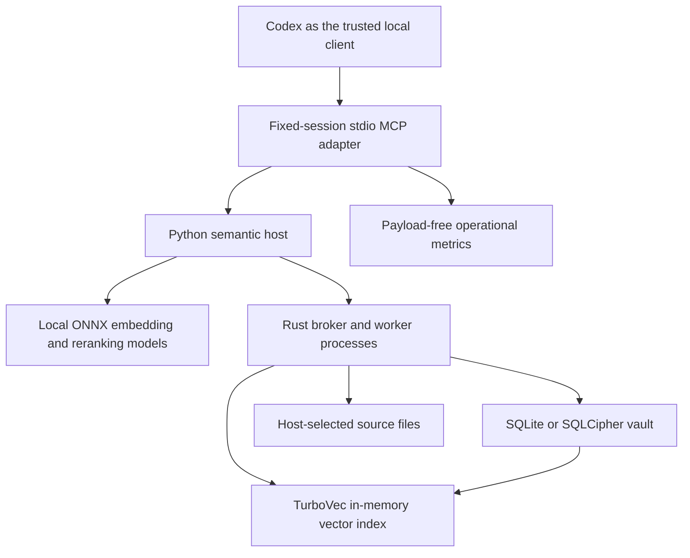

# How MemoryCore Ai - For Codex works

I built MemoryCore AI around a simple goal: retain useful evidence outside the active conversation, then return the smallest relevant context that preserves its meaning. I separate durable storage, search, local inference and the client-facing interface so their responsibilities and costs are visible.

This guide describes the published native **0.5.0-dev** and Python/reference **0.10.0-dev** implementation. I still require synthetic data. Implemented mechanisms are not a claim of production readiness.

I group the host and broker under “MemoryCore” in this overview. The detailed component diagram below separates them.

## The components and their responsibilities

I use the arrows to show component relationships. Source files and the vault hold evidence; model scores and the search index help select candidates. My final retrieval path rechecks evidence eligibility before returning a packet.

| Component | Why I use it | Implementation |
| --- | --- | --- |
| MCP adapter | Present one compact `memory` tool and bind calls to an existing host-selected session | [native_mcp.py](../scripts/native_mcp.py) |
| Python semantic host | Coordinate embeddings, reranking, indexing work, bounded caches and resource admission | [memory_host.py](../scripts/memory_host.py) |
| FastEmbed and ONNX Runtime | Run explicitly provisioned embedding and ranking models locally | [vector_pipeline.py](../scripts/vector_pipeline.py) |
| Rust and Tokio | Validate and dispatch bounded requests to native reader/writer processes | [main.rs](../rust-broker/src/main.rs), [scheduler.rs](../rust-broker/src/scheduler.rs) |
| rusqlite and SQLite | Commit durable records, versions, evidence bindings and lifecycle state transactionally | [database.rs](../rust-broker/src/native/database.rs) |
| SQLCipher | Encrypt database storage when the optional encrypted build and keyed configuration are selected | [Cargo.toml](../rust-broker/Cargo.toml), [backup.rs](../rust-broker/src/native/backup.rs) |
| TurboVec 1.0.0 | Build a compact, four-bit vector index and shortlist semantic candidates | [vectors.rs](../rust-broker/src/native/vectors.rs), [vendored source](../rust-broker/vendor/turbovec) |
| Tokenizers | Count the rendered context against explicit budgets | [memory_packets.py](../scripts/memory_packets.py), [knowledge.rs](../rust-broker/src/native/knowledge.rs) |
| Operational monitor | Measure latency, counts, estimated tokens and resource conditions without storing memory payloads | [monitored_native_mcp.py](../scripts/monitored_native_mcp.py) |

## Following a fact through the system

1. **Select evidence.** A trusted host chooses the scope and source root. A proposal names a supported relative source path. The knowledge layer checks the source and constructs reviewable evidence; it does not silently ingest all conversations.
2. **Review and accept.** The proposal carries source identity and a review digest. Acceptance rechecks both. A correction identifies the current record so stale edits cannot silently overwrite newer state.
3. **Commit durable state.** The vault stores the fact, provenance, source binding and relevant lifecycle/version metadata. Optional detail remains separate from the summary used for ordinary recall.
4. **Prepare search data.** The semantic host processes eligible indexing jobs with a reviewed local embedding model. The native runtime stores validated vectors and builds or updates a TurboVec index.
5. **Retrieve for a question.** Lexical and semantic candidates are combined, scored, source-checked and filtered. Reranking and requested-field checks help select relevant evidence. I disclose fallback or omitted results rather than implying an exhaustive answer.
6. **Return compact context.** The final packet preserves whole facts, identifiers, provenance and qualifications within its token budget. The assistant still decides how to use that evidence in the current task.

I describe the selection algorithm and model identities in [retrieval and TurboVec](RETRIEVAL.md), and persistence in [storage and lifecycle](STORAGE_AND_LIFECYCLE.md).

## Why there is both Rust and Python

I use Rust for the authoritative native broker, persistence, lifecycle checks and index operations. I use Python for the standard semantic host, local model runtime, experiments and the reference implementation. The native broker does not silently fall back to the Python reference backend if it fails.

The reference CLI remains useful for small synthetic experiments and parity tests. Its scope strings are filters, and its SQLite database is plaintext. The native host adds explicit session configuration and an optional SQLCipher build. I therefore document these as separate execution paths rather than treating every capability as present in every mode.

The raw native broker can perform lexical operations without a Python inference process. Automatic text-to-vector recall uses the Python semantic host and provisioned models. Compiling TurboVec does not automatically populate a vault with embeddings.

## Concurrency and resource use

I keep one coordinated SQLite writer per vault and separate read-only workers. The native configuration permits one to eight read workers and up to 128 sessions, with a 32-request admission bound. These are configured limits, not measured throughput guarantees.

The semantic host adds bounded foreground read/write lanes, inference admission and background indexing. A write waiting for SQLite should not consume every recall lane. Backpressure is an explicit result; queue and worker deadlines can reject requests, and an interrupted write may have an unknown outcome.

Index/model caches reduce repeated computation but consume local memory. Each independently launched MCP adapter currently owns a semantic host, so multiple adapters can duplicate resident models. I do not claim that a many-session benchmark proves many-process deployment capacity.

Source: [broker limits](../rust-broker/src/lib.rs), [host scheduling](../scripts/memory_host.py), [resource budget](../scripts/resource_budget.py), [resource limits](../scripts/resource_limits.py).

## Where token efficiency comes from

I target selective retention, a compact tool catalogue, small relevant recall packets, selective detail and deliberate continuity checkpoints. These can reduce repeated history and evidence reads. They also introduce acquisition, review, lookup and maintenance costs.

I keep three measurements separate:

| Mechanism | What becomes smaller | What I do not infer from it |
| --- | --- | --- |
| Zlib record compression | Stored record bytes | Fewer decoded prompt tokens |
| TurboVec four-bit quantisation | The vector search representation | Smaller raw facts or a guaranteed whole-vault reduction |
| Selective context retrieval | The evidence included in a prompt | Lower total provider cost without counting the complete workflow |

My [evaluation guide](EVALUATION.md) explains comparisons with equal evidence and answer quality. A small source file may still be cheaper to read directly.

## Trust and integration boundaries

I treat recalled text as untrusted data. A matching hash establishes byte freshness, not factual truth. A model score is not authority. The trusted launcher owns session configuration, source roots and keys; the local pipe is not an authenticated public API.

I have not implemented automatic native chat capture, cross-device synchronisation, universal client compatibility or a hosted multi-user service. Lifecycle and quota observations must come from a trusted host. The route outbox prepares durable handoffs but does not automatically send desktop messages.

I document protocol details in [interfaces and operations](INTERFACES.md), and current dependency/security limitations in [SECURITY.md](../SECURITY.md).
